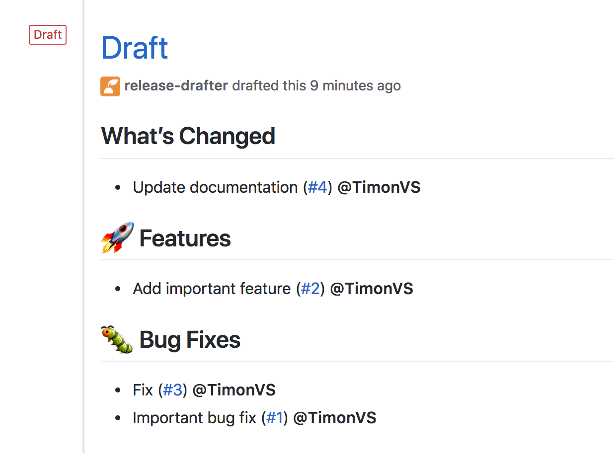

# SODALITE Continous Integration demo
Repository to demonstrate Github Actions, used in [SODALITE-EU](https://github.com/SODALITE-EU) Continous Integration.

## Quick Start
To implement SODALITE Continous Integration to your Repository, just copy [.github](.github) directory.

## GitHub Actions Workflow
Both [Release Drafter](https://github.com/marketplace/actions/release-drafter) and [PR Labeler](https://github.com/marketplace/actions/pr-labeler) can be used in [GitHub Actions Workflows](https://docs.github.com/en/free-pro-team@latest/actions/learn-github-actions) by configuring a YAML-based files in [.github/workflows](.github/workflows) dir.

### Checking progress
Workflows' progress can be inspected on [Actions tab](https://github.com/mihaTrajbaric/SODALITE-CI-demo/actions). Repository owners can also Re-run jobs and delete or edit workflows. 

## PR Labeler
[PR Labeler](https://github.com/marketplace/actions/pr-labeler) is a GitHub Action that automatically applies labels to your Pull Requests based on branch name patterns like `feature/*` or `fix/*`
Configure by creating a [.github/pr-labeler.yml](.github/pr-labeler.yml) file.

For example:
```yaml
feature: ['feature/*', 'feat/*']
bugfix: ['fix/*','bugfix/*','bug/*']
chore: chore/*
fixed-branch: fixed-branch-name
```

Then if a pull request is opened with the branch name `feature/218-add-emoji-support` the Action will automatically apply the `feature` label.


## Release Drafter
[Release Drafter](https://github.com/marketplace/actions/release-drafter) drafts your next release notes as pull requests are merged into master.
Configure by creating a [.github/release-drafter.yml](.github/release-drafter.yml) file.

Sample Configuration:
```yaml
name-template: '$RESOLVED_VERSION'
tag-template: '$RESOLVED_VERSION'
categories:
  - title: '🚀 Features'
    labels:
      - 'feature'
      - 'enhancement'
  - title: '🐛 Bug Fixes'
    labels:
      - 'fix'
      - 'bugfix'
      - 'bug'
  - title: '🧰 Maintenance'
    label: 'chore'
change-template: '- $TITLE @$AUTHOR (#$NUMBER)'
change-title-escapes: '\<*_&'
version-resolver:
  major:
    labels:
      - 'major'
  minor:
    labels:
      - 'minor'
  patch:
    labels:
      - 'patch'
  default: patch
template: |
  ## Changes
  $CHANGES
```

Which produces draft like this:



Note only Pull Requests will appear as `changes` so making PRs instead of committing directly to master is a necessity.
### Basic configuration options

#### Categories

With the `categories` option you can categorize pull requests in release notes using labels. For example, append the following to your `.github/release-drafter.yml` file:

```yml
categories:
  - title: '🚀 Features'
    label: 'feature'
  - title: '🐛 Bug Fixes'
    labels:
      - 'fix'
      - 'bugfix'
      - 'bug'
```

Pull requests with the label "feature" or "fix" will now be grouped together:


Adding such labels to your PRs is meant to be automated by using [PR Labeler](#pr-labeler) or similar Action Plugin.

#### Version Resolver

With the `version-resolver` option version number incrementing can be resolved automatically based on labels of individual pull requests. Append the following to your `.github/release-drafter.yml` file:

```yml
version-resolver:
  major:
    labels:
      - 'major'
  minor:
    labels:
      - 'minor'
  patch:
    labels:
      - 'patch'
  default: patch
```

The above config controls the output of the `$RESOLVED_VERSION` variable.

If a pull requests is found with the label `major`/`minor`/`patch`, the corresponding version key will be incremented from a semantic version. The maximum out of major, minor and patch found in any of the pull requests will be used to increment the version number. If no pull requests are found with the assigned labels, the `default` will be assigned.

Adding such labels is meant to be manual, so repository owner/contributor can have full control over versioning.